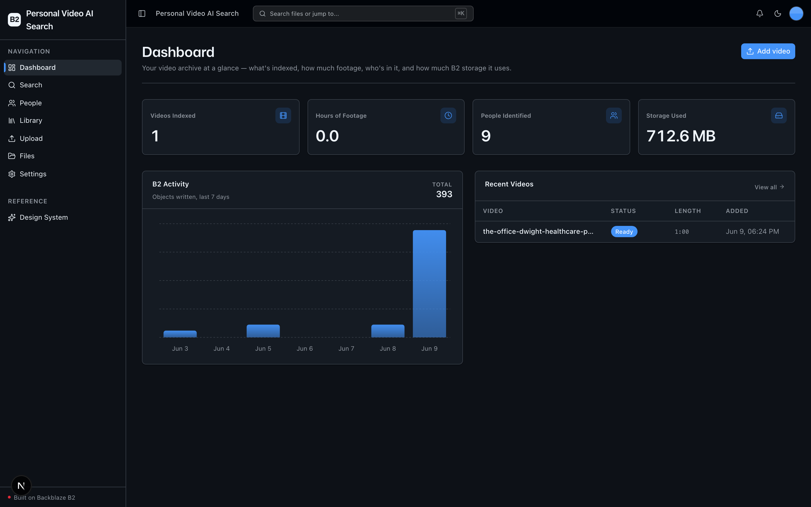
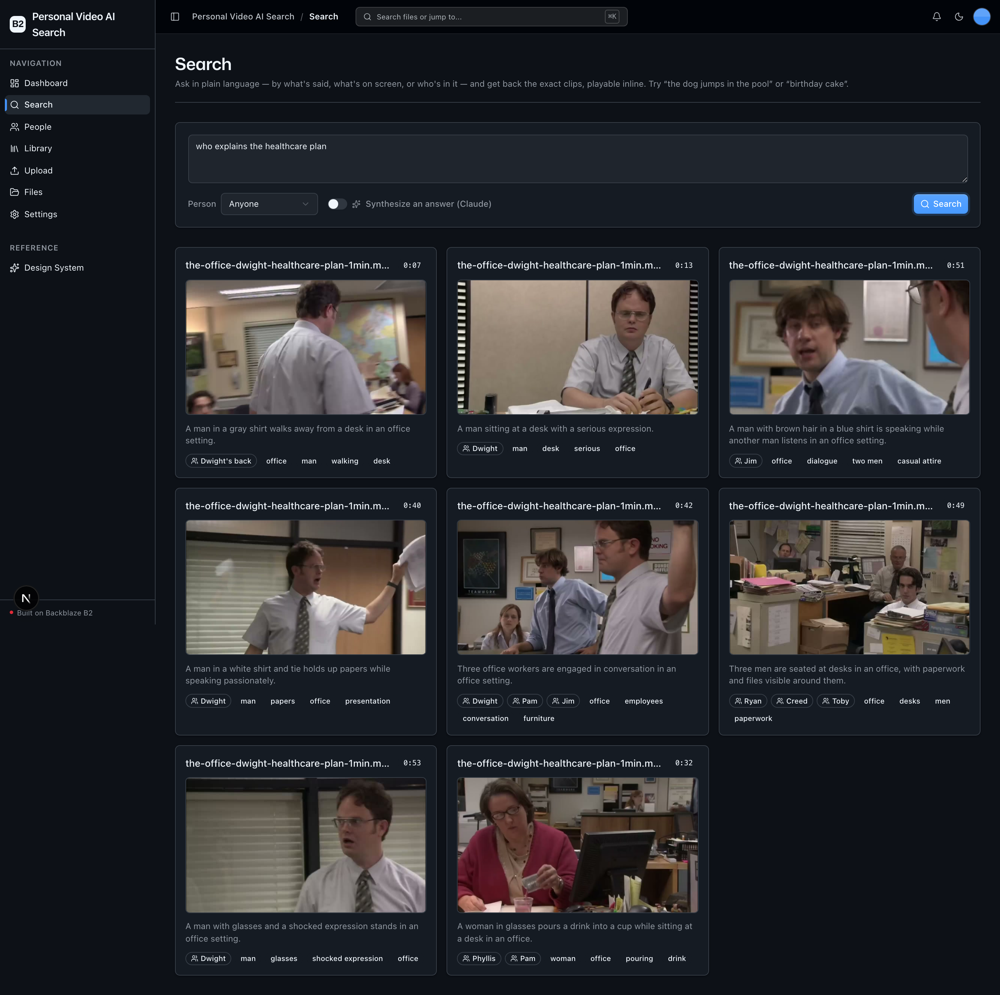
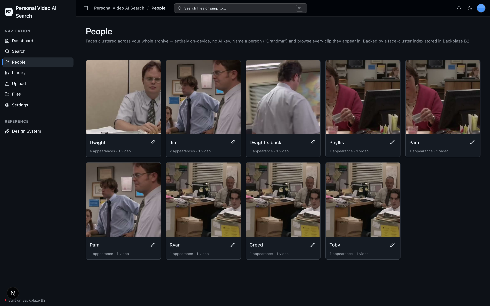

<!-- last_verified: 2026-06-09 -->
# Personal Video AI Search

**AI photo search, for your video library.** Upload your personal video archive
— phone clips, home videos — straight to **[Backblaze B2](https://www.backblaze.com/sign-up/ai-cloud-storage?utm_source=github&utm_medium=referral&utm_campaign=ai_artifacts&utm_content=b2ai-personal-video-ai-search)**,
and a multimodal pipeline indexes every clip on **three signals**:

- a **Whisper transcript** (what's said),
- **AI scene tags + captions** from sampled keyframes (what's on screen), and
- **clustered faces** (who's in it) — detected entirely on-device, no AI key.

Then ask in plain language — *"find the clip where the dog jumps in the pool"* —
or browse by **person** — *"show me every clip of Grandma"* — and get back the
exact clips, playable inline by seeking the original in B2. Everything (the
originals, audio, thumbnails, transcripts, the embedding index, and the
face-cluster index) lives in B2. **There is no database.**

This is a worked reference for a *data-heavy, multimodal* AI pipeline on B2: the
**bulk write path** (presigned multipart, browser → B2 direct, multi-GB) and the
**repeated small-read path** (presigned Range reads to seek clips, thumbnail
fetches).

## What it looks like

**Dashboard** — videos indexed, hours of footage, people identified, storage used:



**Search** — natural-language query → ranked, playable clips with scene captions and people:



**People** — faces clustered across the whole archive; name a person, browse their clips:



## How it works

```
Browser ──presigned multipart──▶ B2 (source video, multi-GB, direct)
                                  │
            complete ────────────▶ FastAPI  ──background task──▶ index pipeline
                                                                  │
   1. probe (ffprobe: duration/res/fps/codec)                     │
   2. transcribe audio (Whisper)               ──▶ transcript.json (B2)
   3. sample scene-change keyframes (ffmpeg)   ──▶ thumbs/*.jpg    (B2)
      + caption/tag each (gpt-4o-mini vision)  ──▶ scenes.json     (B2)
   4. detect + embed + cluster faces (local)   ──▶ people/index.json (B2)
   5. embed every scene (text-embedding-3-small)──▶ embeddings.json (B2)

Search: query ─▶ embed ─▶ cosine over the B2 indexes ─▶ ranked clips
                          (optional person filter + Claude answer)
```

B2 is the sole datastore. The search index and face index are just JSON objects
in the bucket — no vector DB, no Postgres.

## Features

- **[Video ingest](docs/features/video-ingest.md)** — presigned multipart,
  browser → B2 direct, multi-GB; the API never buffers the bytes.
- **[Visual scene indexing](docs/features/visual-indexing.md)** — scene-change
  keyframes → multimodal captions + tags. Powers "the dog jumps in the pool".
- **[People (face clustering)](docs/features/people.md)** — local face
  detect/embed/cluster across the archive; name a person, browse their clips.
  $0 API cost.
- **[Transcription](docs/features/transcription.md)** — Whisper timestamped
  transcript per clip, the third search signal.
- **[Cross-archive search](docs/features/search.md)** — NL + optional
  person/date filters → ranked, playable clips; optional Claude-synthesized
  answer.
- **[Video Library](docs/features/video-library.md)** — sample-scoped asset
  explorer with per-video pipeline status; watch any video inline (streamed
  from B2 over a presigned Range read) + re-index / delete.
- **[File Browser](docs/features/file-browser.md)** — the starter kit's
  full-bucket explorer, kept as-is.
- **[Design System](docs/design-system.md)** — tokens, primitives, the blaze
  loader, error/empty states. Live preview at `/design`.
- **Graceful degradation** — with no AI key, the generic B2 features
  (upload/files/dashboard) work; the pipeline surfaces a clear "configure a
  provider" state instead of crashing.

## Tech Stack

- TypeScript, Next.js 16, React 19, Tailwind v4, shadcn/ui, Recharts
- TanStack Query — caching, dedup, retry, stale-while-revalidate for every fetch
- Python 3.11+, FastAPI, boto3, Pydantic v2, numpy
- **ffmpeg / ffprobe** — probing, audio extraction, scene-change keyframes
- **OpenAI** — Whisper (`whisper-1`), `gpt-4o-mini` vision, `text-embedding-3-small`
- **Anthropic** *(optional)* — `claude-haiku-4-5` for synthesized answers
- **insightface + onnxruntime + scikit-learn** — local face detect / embed / cluster
- Backblaze B2 (S3-compatible object storage) — the sole datastore
- pnpm workspaces (monorepo)

## Quick Start

You need: Node.js >= 20, pnpm >= 9, Python >= 3.11, **ffmpeg**, and a free
**[Backblaze B2 account](https://www.backblaze.com/sign-up/ai-cloud-storage?utm_source=github&utm_medium=referral&utm_campaign=ai_artifacts&utm_content=b2ai-personal-video-ai-search)**.
An **OpenAI API key** unlocks the index pipeline (optional — the app runs
B2-only without it).

**1. Install dependencies**

```bash
pnpm install
```

**2. Install ffmpeg** (system prerequisite for the index pipeline)

```bash
brew install ffmpeg            # macOS
# or: sudo apt-get install ffmpeg   (Debian/Ubuntu)
```

**3. Set up the backend**

```bash
cd services/api
python -m venv .venv && source .venv/bin/activate
pip install -r requirements.txt
cd ../..
```

> The first video you index with face detection downloads the local face model
> weights (insightface) once. That requires network access on first run; after
> that, faces are detected entirely offline at $0 cost.

**4. Add your credentials**

```bash
cp .env.example .env
```

Head to the [Backblaze B2 dashboard](https://secure.backblaze.com/b2_buckets.htm?utm_source=github&utm_medium=referral&utm_campaign=ai_artifacts&utm_content=b2ai-personal-video-ai-search) and:

1. **Create a bucket.** Paste into `.env`:
   - **Bucket Unique Name** → `B2_BUCKET_NAME`
   - **Endpoint** → `B2_ENDPOINT`
   - the region in the endpoint (e.g. `us-west-004`) → `B2_REGION`
2. **Create an application key** with `Read and Write`. Paste into `.env`:
   - **keyID** → `B2_APPLICATION_KEY_ID`
   - **applicationKey** → `B2_APPLICATION_KEY` *(only shown once)*
3. *(Optional)* add `OPENAI_API_KEY` to enable transcription + scene tagging +
   search, and `ANTHROPIC_API_KEY` for synthesized answers.
4. *(Optional)* set `NEXT_PUBLIC_SEARCH_FILTERS_ENABLED=true` to show
   date/event Search filters. Leave it `false` during rolling deploys until the
   backend fleet is upgraded and drained.

You must also add a **CORS policy** to the bucket so the browser can PUT
multipart parts directly and read the ETag header — see
[docs/features/video-ingest.md](docs/features/video-ingest.md).

> Walkthroughs: [creating a bucket](https://www.backblaze.com/docs/cloud-storage-create-and-manage-buckets?utm_source=github&utm_medium=referral&utm_campaign=ai_artifacts&utm_content=b2ai-personal-video-ai-search) · [creating app keys](https://www.backblaze.com/docs/cloud-storage-create-and-manage-app-keys?utm_source=github&utm_medium=referral&utm_campaign=ai_artifacts&utm_content=b2ai-personal-video-ai-search).

**5. Run it**

```bash
pnpm dev
```

Frontend at `localhost:3000`, API at `localhost:8000`. Add a video on the
**Library** page, watch it move through the pipeline, then search it.

`pnpm dev` runs `pnpm doctor` first — a preflight check that catches the common
setup gotchas (wrong Node/Python version, missing venv, missing/placeholder
`.env`, missing ffmpeg, ports already taken). Run it any time with `pnpm doctor`.

## Estimated cost

One full demo run (~4 clips, ~12 min total, ≤8 keyframes each): Whisper ≈ $0.07,
vision tagging ≈ $0.03, embeddings ≈ <$0.01, optional Haiku synthesis ≈ <$0.02.
**Total ≈ $0.13.** Faces are local at $0. Caps in `services/api/app/config/settings.py`
(`MAX_KEYFRAMES_PER_VIDEO`, `MAX_VIDEO_SIZE`, `SCENE_THRESHOLD`) keep it bounded.

## Building on the starter foundation

This app started from the Backblaze B2 full-stack starter foundation. The
reusable scaffolding is kept; the multimodal pipeline + Search/People/Library
surfaces are this app's reason to exist.

- **Keep** the UI kit (`apps/web/src/components/ui/` + tokens in `globals.css` + `/design`).
- **Keep** the full-bucket File Browser (`/files`) and generic Upload (`/upload`).
- **This app's core**: Library (`/library`), Search (`/search`), People (`/people`),
  and the pipeline under `services/api/app/repo|service|runtime/`.

Full contract: [AGENTS.md §2](AGENTS.md#2-app-surfaces).

## Commands

| Command | What it does |
|---------|-------------|
| `pnpm dev` | Start frontend + backend |
| `pnpm dev:web` | Frontend only |
| `pnpm dev:api` | Backend only |
| `pnpm build` | Build frontend |
| `pnpm lint` | Lint frontend |
| `pnpm lint:api` | Lint backend (ruff) |
| `pnpm test:api` | Run backend tests |
| `pnpm check:structure` | Verify layering rules |
| `pnpm test:e2e` | Playwright e2e tests (run `pnpm --filter @personal-video-ai-search/web exec playwright install chromium` once first) |

## Documentation Map

| Doc | Purpose |
|-----|---------|
| [AGENTS.md](AGENTS.md) | Agent table of contents — start here |
| [ARCHITECTURE.md](ARCHITECTURE.md) | System layout, layering, data flows |
| [docs/features/](docs/features/) | Feature docs (ingest, visual indexing, people, transcription, search, library, file browser) |
| [docs/design-system.md](docs/design-system.md) | Design tokens, primitives, loader, error/empty states |
| [docs/app-workflows.md](docs/app-workflows.md) | User journeys |
| [docs/dev-workflows.md](docs/dev-workflows.md) | Engineering workflows and testing |
| [docs/SECURITY.md](docs/SECURITY.md) | Security principles |
| [docs/RELIABILITY.md](docs/RELIABILITY.md) | Reliability expectations |
| [docs/exec-plans/](docs/exec-plans/) | Execution plans and tech debt tracker |

## License

MIT License - see [LICENSE](LICENSE) for details.

## Claude Agent B2 Skill

Manage Backblaze B2 from your terminal using natural language (list/search, audits, stale or large file detection, security checks, safe cleanup).

Repo: [https://github.com/backblaze-b2-samples/claude-skill-b2-cloud-storage](https://github.com/backblaze-b2-samples/claude-skill-b2-cloud-storage)
